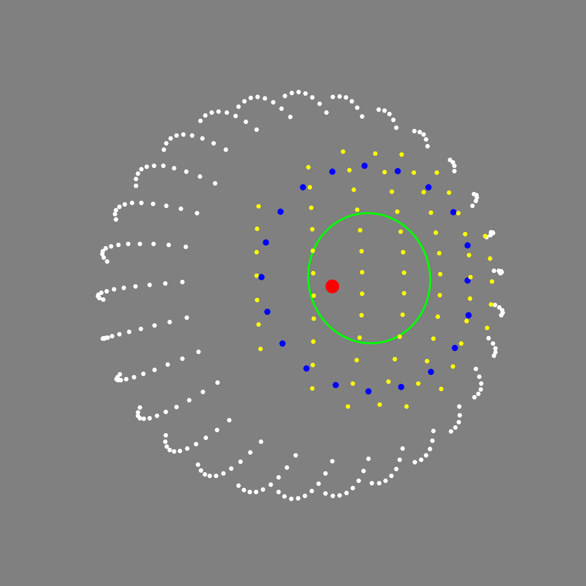
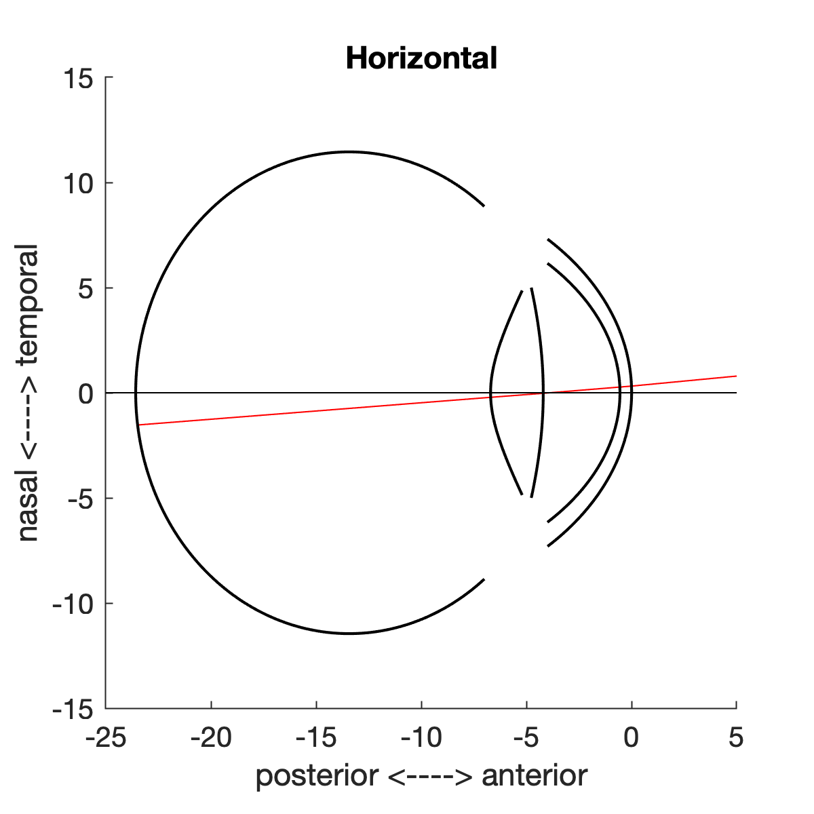
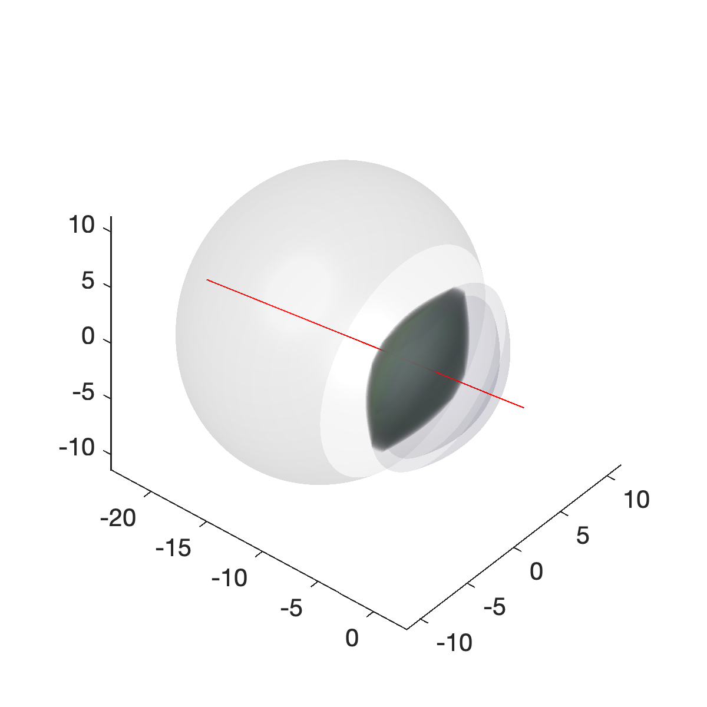

findPupilRay# A model of the entrance pupil and retinal landmarks

<p float="left">
  
  
   
</p>


These routines implement a ray-traced model eye in MATLAB. The software is designed specifically to support calculation of the:
- appearance of the entrance pupil in the image plane for a rotated eye
- location of the glint in an image from a light source for a rotated eye
- location of retinal landmarks (fovea, optic disc)
- mapping of the visual field to retinal locations
- optical properties of the eye (power, optical center, axes, etc)
- effect of biometric variation upon these measurements
- effect of artificial lenses (contacts, spectacles) upon these measurement

The model is described in:

 * GK Aguirre (2019) [A Model of the Entrance Pupil of the Human Eye](https://www.nature.com/articles/s41598-019-45827-3). Scientific Reports, volume 9, Article number: 9360 (2019) 

The anatomical properties of the eye are described in a set of routines that account for variation in biometric properties as a function of variation in spherical refractive error (ametropia). Ray tracing through the optical components of the eye (and any artificial lenses) is implemented as skew rays through generalized quadric surfaces. The routine `findPupilRay.m` calculates the effect of refraction, making use of calls to `rayTraceQuadrics.m`. An improvement in execution time can be achieved by compiling the ray tracing routines. To do so, issue the command `compileInverseRayTrace` at the MATLAB console. A compiled MEX file version of `findPupilRay` will be placed in the `bin` directory of this repository if it is not already present.

The function `projectModelEye` implements a forward model of the appearance of the entrance pupil in a camera observing the eye. Inputs to this routine are:
 * `eyePose` which is a vector that describes dynamic aspects of the eye, specifically rotation in degrees of azimuth, elevation, and torsion, and the radius of the aperture stop in mm.
 * `sceneGeometry` which is a structure that describes static aspects of the scene, including the parameters of the model eye and the properties and position of a pinhole camera. The sceneGeometry structure is generated by the function `createSceneGeometry`. By default, the model assumes that the eye is being observed in the near infra-red range. To use refractive index values appropriate for the visible range, pass the key-value pair `'spectralDomain','vis'` when creating the scene geometry.

The entrance pupil is described by the parameters of an ellipse fit to the pupil perimeter, and those parameters are given in "transparent" form (center x, center y, area, non-linear eccentricity, tilt).

Most of the functions take key-value pairs that adjust the default behavior of the model. For example, you can generate a -3 diopter, myopic left eye that is wearing glasses with an appropriate corrective lens with the call:
```
createSceneGeometry('eyeLaterality','left','sphericalAmetropia',-3,'spectacleLens',-3)`.
```

The function `eyePoseEllipseFit` implements a search over eyePose parameters and executions of the forward model to find the eyePose values that best describe an observed pupil perimeter. This is used to support model-based eye tracking with [transparentTrack](https://github.com/gkaguirrelab/transparentTrack)

To install and configure the repository, first install [toolboxToolbox (tBtB)](https://github.com/ToolboxHub/ToolboxToolbox), which provides for declarative dependency management for Matlab. Once tBtB is installed, the code will be installed and readied for use with the command `tbUse('gkaModelEye');`. The code requires the optimization, robotics, and statistics Matlab toolboxes. The code has no required dependencies external to Matlab, although the optional ExampleTest toolbox is installed by the tbUse command.

A good place to start is to render the model eye for different poses and examine the parameters of the pupil ellipse. This example renders an emmetropic right eye, observed in the near infra-red range, that is rotated to -30 degrees azimuth, -5 degrees elevation, and has an aperture stop 2 mm in radius.
```
    sceneGeometry=createSceneGeometry();
    eyePose = [-30 -5 0 2];
    renderEyePose(eyePose, sceneGeometry);
    pupilEllipse = projectModelEye(eyePose,sceneGeometry);
```

The components of the model eye can be displayed in a cross-section schematic:
```
    sceneGeometry=createSceneGeometry();
    plotModelEyeSchematic(sceneGeometry.eye);
```

Also as a 3D ray-traced system:
```
    sceneGeometry=createSceneGeometry();
    plotOpticalSystem('surfaceSet',sceneGeometry.refraction.retinaToCamera,'addLighting',true);
```


A hierarchy of the functions is as follows:
```
    projectModelEye  <--  createSceneGeometry
            |                   ├── modelEyeParameters
            V                   |    ├─ human.stop
     findPupilRay            |    ├─ human.cornea
            |                   |    └─ human.retina, etc.
            V                   |    
    rayTraceQuadrics            └─ assembleOpticalSystem
```

Most functions have associated examples in the header comments. To automatically run all examples, ensure that the [ExampleTest toolbox](https://github.com/isetbio/ExampleTestToolbox.git) is on the path. This command will then test all examples:
```
	[names,status] = RunExamples(fullfile(userpath(),'toolboxes','gkaModelEye'))
```

