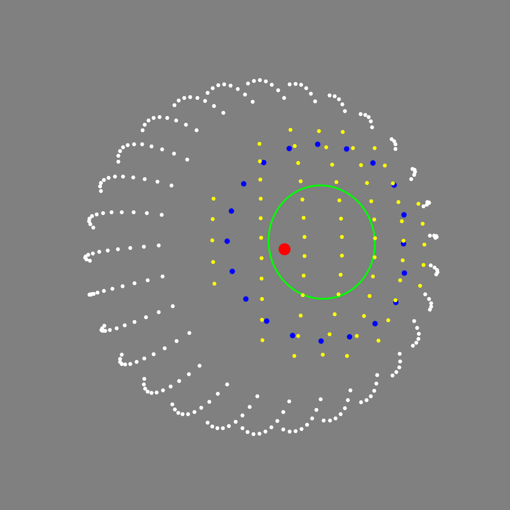
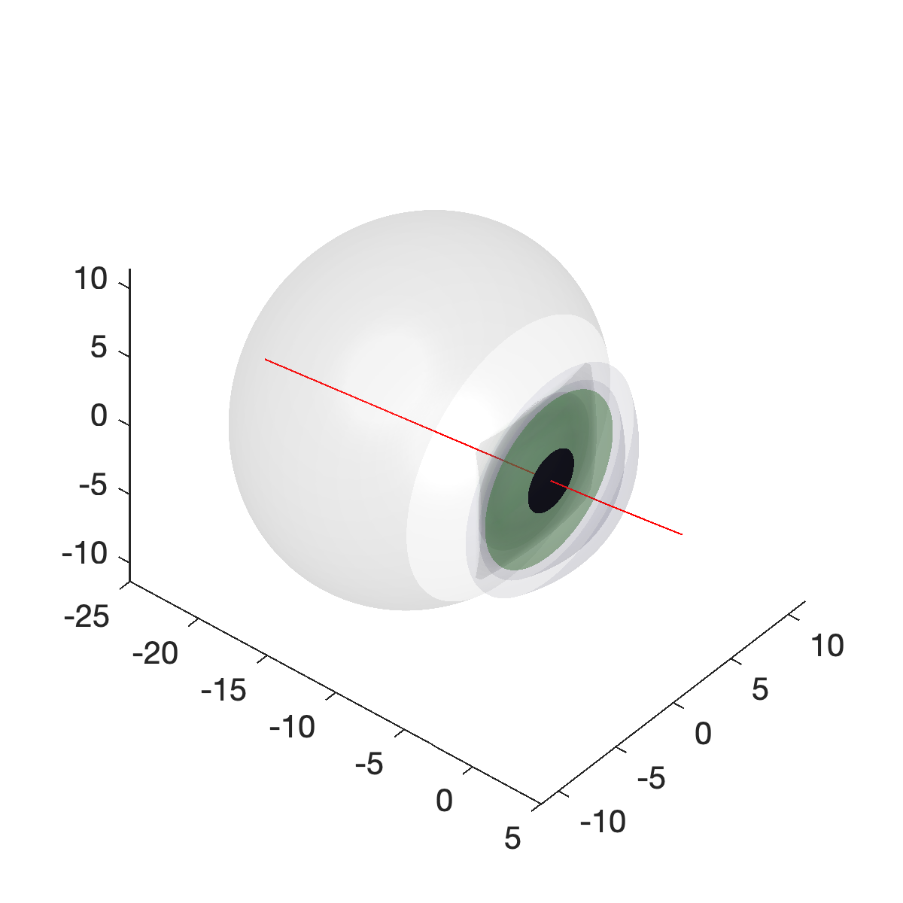

# A model of the optics, biometry, and appearance of the human eye

<p float="left">
  
  
   
</p>

These routines implement a ray-traced model eye in MATLAB. The software calculates:
- appearance of the entrance pupil in the image plane for a rotated eye
- location of the glint in an image from a light source for a rotated eye
- location of retinal landmarks (fovea, optic disc)
- mapping of the visual field to retinal locations
- optical properties of the eye (power, optical center, axes, etc)
- effect of biometric variation (such as myopia) upon these measurements
- effect of artificial lenses (contacts, spectacles) upon these measurements

The model is described in:

 * GK Aguirre (2019) [A Model of the Entrance Pupil of the Human Eye](https://www.nature.com/articles/s41598-019-45827-3). Scientific Reports, volume 9, Article number: 9360 (2019) 
 * GK Aguirre (2021) [A Model of the Appearance of the Moving Human Eye](https://www.biorxiv.org/content/10.1101/2021.02.02.429411v1). bioRxiv 

## Basics

The anatomical properties of the eye are described in a set of routines that account for biometric variation, includng spherical refractive error (ametropia). Ray tracing through the optical components of the eye (and any artificial lenses) is implemented as skew rays through generalized quadric surfaces. The routine `findPupilRay.m` calculates the effect of refraction, making use of calls to `rayTraceQuadrics.m`.

The function `projectModelEye` implements a forward model of the appearance of the entrance pupil and glint in a camera observing the eye. The model can also render the appearance of the entire model eye. Inputs to this routine are:
 * `eyePose` which is a vector that describes dynamic aspects of the eye, specifically rotation in degrees of azimuth, elevation, and torsion, and the radius of the aperture stop in mm.
 * `sceneGeometry` which is a structure that describes static aspects of the scene, including the parameters of the model eye and the properties and position of a pinhole camera. The sceneGeometry structure is generated by the function `createSceneGeometry`. By default, the model assumes that the eye is being observed in the near infra-red range. To use refractive index values appropriate for the visible range, pass the key-value pair `'spectralDomain','vis'` when creating the scene geometry.
 
The eye rotation accounts for Listing's Law, and implements biologically accurate motion about separate rotation centers for vertical and horizontal eye movements.

The entrance pupil is described by the parameters of an ellipse fit to the pupil perimeter, and those parameters are given in "transparent" form (center x, center y, area, non-linear eccentricity, tilt).

Most of the functions take key-value pairs that adjust the default behavior of the model. For example, you can generate a -3 diopter, myopic left eye that is wearing glasses with an appropriate corrective lens with the call:
```
createSceneGeometry('eyeLaterality','left','sphericalAmetropia',-3,'spectacleLens',-3).
```

The function `eyePoseEllipseFit` implements a search over eyePose parameters and executions of the forward model to find the eyePose values that best describe an observed pupil perimeter. This is used to support model-based eye tracking with [transparentTrack](https://github.com/gkaguirrelab/transparentTrack)

## Configure

To configure the repository, first install [toolboxToolbox (tBtB)](https://github.com/ToolboxHub/ToolboxToolbox), which provides for declarative dependency management for Matlab. Once tBtB is installed, the code will be installed and readied for use with the command `tbUse('gkaModelEye');`. Alternatively, you can simply add the repository (and its subdirectories) to the Matlab path using `addpath(genpath('myLocalPath/gkaModelEye'))`

This repository requires several of the MATLAB toolboxes. The code has no required dependencies external to Matlab, although demos that create animated gifs require the [gif function](https://www.mathworks.com/matlabcentral/fileexchange/63239-gif), and automated testing of all examples uses the [ExampleTest toolbox](https://github.com/isetbio/ExampleTestToolbox.git). These external repositories are installed by the tbUse command.

If you do not use `toolboxToolbox` to configure the repository, you can test for the availability of the necessary MATLAB toolboxes by running the script `gkaModelEyeLocalHookTemplate.m` that is located within the `config` directory.

An improvement in execution time of the code can be achieved by compiling the ray tracing routines. To do so, issue the command `compileInverseRayTrace` at the MATLAB console. Compiled MEX file versions of `findPupilRay` and `findGlintRay` will be placed in the `bin` directory of this repository if they are not already present.

## Quick start

A good place to start is to create a default model eye and then examine the effect of different poses. This example defines an emmetropic right eye, observed in the near infra-red range:
```
sceneGeometry = createSceneGeometry();
```

You can then define an eye pose. This example rotates the eye to -30 degrees in azimuth, -5 degrees elevation, 0 degrees torsion, with an aperture stop 2 mm in radius:
```
eyePose = [-30 -5 0 2];
```

You can then obtain the parameters of the entrance pupil ellipse:
```
pupilEllipse = projectModelEye(eyePose, sceneGeometry);
```

And render the appearance of the eye as seen by a camera:
```
renderEyePose(eyePose, sceneGeometry);
```

The variable `sceneGeometry` is a structure. Examine the contents of the fields to get a sense of the model elements. Once you have a sceneGeometry, you can use it to create different displays of the eye. For example, the components of the model eye can be displayed in a cross-section schematic:
```
plotModelEyeSchematic(sceneGeometry);
```

Also as a set of 3D quadric surfaces:
```
plotOpticalSystem(sceneGeometry);
```

## Demos and unit tests

Most functions have associated examples in the header comments. To automatically run all examples, ensure that the [ExampleTest toolbox](https://github.com/isetbio/ExampleTestToolbox.git) is on the path. This command will then test all examples:
```
[names,status] = RunExamples(fullfile(userpath(),'toolboxes','gkaModelEye'))
```

Additional demos and examples can be found in the `demos` and `twitter` directories.
